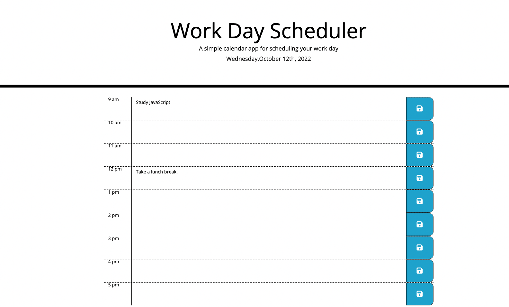

# Work Day Scheduler

Welcome! Everyone's lives are busy, and sometimes we need a little help to organize our plans or tasks. This is where my work day scheduler comes in! As a user of the scheduler, (screenshot below), one is able to easily able to type in a task that needs to be completed and then save it. Once the task is saved, the user will be able to refresh the page, and it will still be there! I'll explain the coding behind how that's able to be done below. 

[Deployed Website](https://amylipscomb.github.io/work-day-scheduler/)

<strong>My Task</strong>

In order to create a scheduler that utilizes time, I had to use 