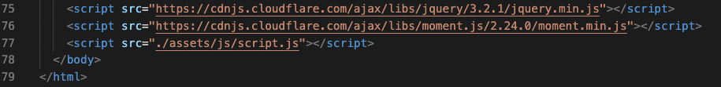

# Work Day Scheduler

Welcome! Everyone's lives are busy, and sometimes we need a little help to organize our plans or tasks. This is where my work day scheduler comes in! As a user of the scheduler, (screenshot below), one is able to easily able to type in a task that needs to be completed and then save it. Once the task is saved, the user will be able to refresh the page, and it will still be there! I'll explain the coding behind how that's able to be done below. 

[Deployed Website](https://amylipscomb.github.io/work-day-scheduler/)

<strong>My Task</strong>

In order to create a scheduler that utilizes time, I had to utilize HTML, CSS, and JavaScript. Within the the HTML, I had to include coding for the timeblocks. To do this, I created a div, and named the class "row hour" because I wanted the hours to be listed as rows, and made each id it's own hour. Since most people start their business day around 9:00 am, that was the hour I began with. I then had to add another class, "col-1" so that it would create a column, and along with that a "textarea" so that when a someone uses the scheduler, a task can actually be typed in. Below is a copy of the coding. 

In order to make the coding easier, I used military time. You can see within the screenshot, once it turns 1:00 pm. Instead of typing in 1:00, I used the military time for 1:00, which is 13:00. I continued to do this, until I reached the military time (17:00) for 5:00 pm. 

Another thing to note, is that since I had to use moment.js, within the HTML file, the moment library had to be linked. 

I then moved on to creating the jQuery code. Utilizing the moment.js library, in order to get the current date, I used the code below: 

Within this code, I formatted the current date in a way that would display the date as a text. By using this code, every day the date will change, because the day has changed. As a user of the scheduler, this is extremely useful. 

I continued to use jQuery to use localStorage. 

The purpose of localstorage is to save data within a browser, even after the window to the corresponding browser has been closed. Localstorage is incredibly useful to a user, specifically when using it for the purpose of storing tasks that need to be done. The first half of the coding  has an event listener. The event listener is basically saying, when you (as the user), click the save button, it will actually 'click'. You can see an example below:

Within the console, you can see that the user has clicked 'save' on the task, "Study JavaScript", twice, clicked 'save' on the empty box for the 10:00 am slot once, and then clicked 'save' on the 12:00 pm time slot, twice. 

The second half of the coding shown above, is saving the keys and their values to the local storage, so that when the page is refreshed, whatever was in the textboxes will continue to be there. In order to check to make sure the local storage was correct, I utilized devTools, particularly the 'Application' section, and then went down to local storage. As you can see, key 9 has the value of 'Study JavaScript', and key 12, has the value 'Take a lunch break'.

While working on the work day scheduler, I made sure to save my work constantly, utilizing 'git push', and made sure that each time I made commits, each commit had descriptive messages. 

<strong>Technologies Used</strong>	

-	HTML 
-	CSS
-	VS Code
-   JavaScript
-   jQuery
-   FontAwesome
-   Moment.JS Library

I hope you enjoyed viewing my work day scheduler, and learning about the process behind the coding!